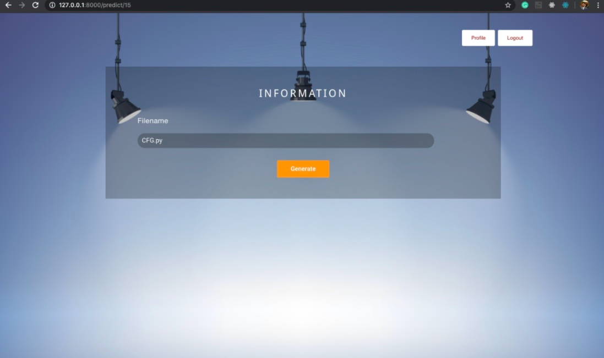
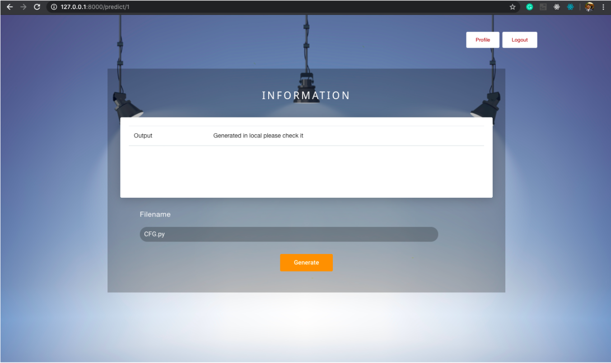
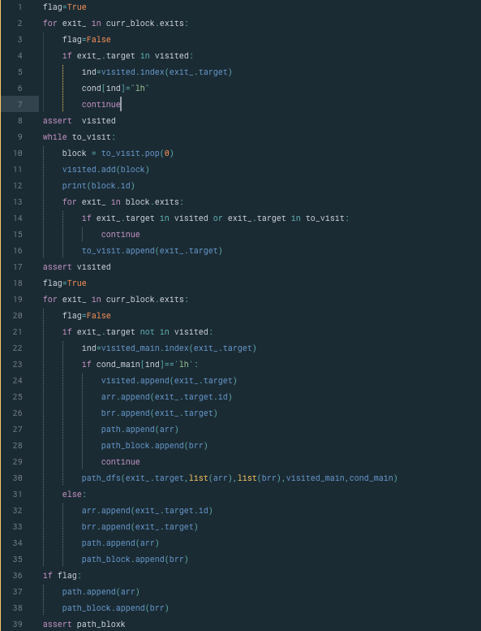
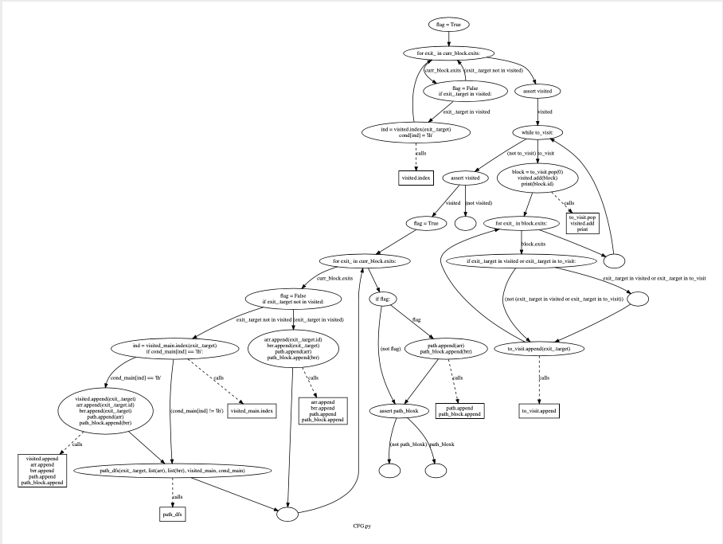
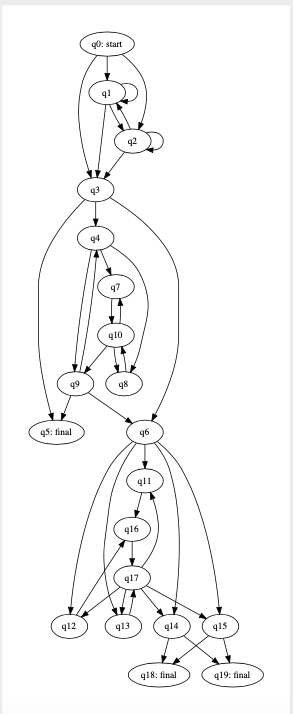
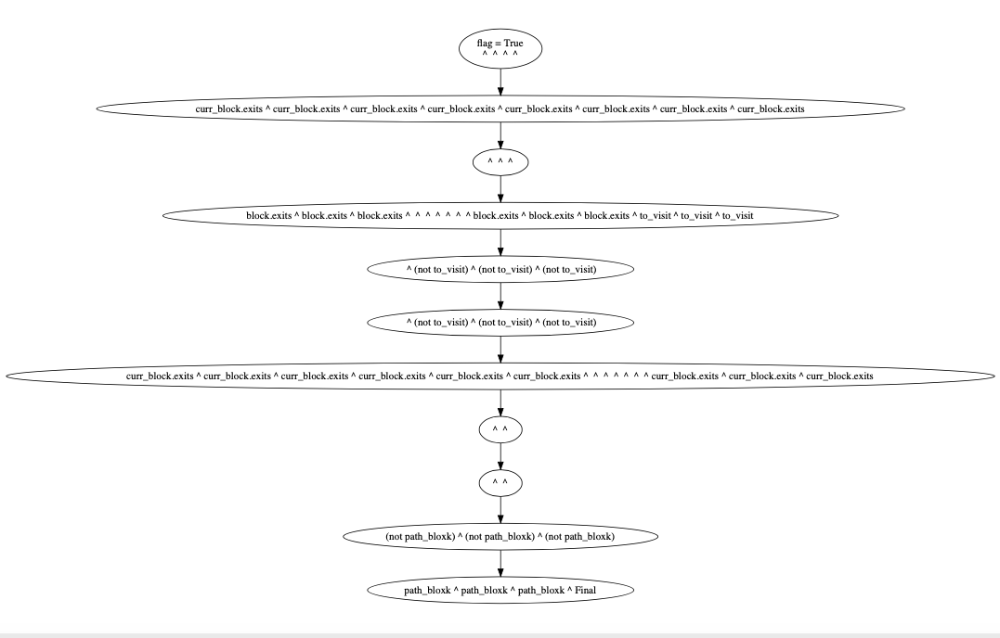

# Path-Dependency-Analysis

Loops are an important part of any programming language. Hence loop analysis is very important
for different software engineering tasks, such as bug detection, test case generation, and program
optimization. Loop analysis, however, is one of the most challenging tasks in program analysis,
particularly when (nested) loops contain multiple paths that have complex interrelated relations. In 
this project we have implemented Path Dependency Automaton (PDA) to summarize the given loops. PDA 
is constructed with the help of Control Flow Graph (CFG). Clearly, loops are dependent on paths since 
control during program execution follows a series of snippets that are interdependent either through 
the program instances including variables or loops. This paper presents a technique of loop summation 
capable of generating loop invariants in an expressive and decisive language and provides theoretical 
guarantees of invariant quality. A summary of a loop captures the relationship between loop inputs and 
outputs as a set of symbolic constraints. For instance, we can use a loop summary to check program 
properties after a loop; and in symbolic execution we can use it to guide test case generation. 
The aim of this study is to explain the interlacing of multiple paths in a nested or non-nested loop and 
to generate a summarization of disjunctive loops for such multi-path loops.

It supports following features:

*	Login/ Sign Up 
*	Viewing and Editing Profile 
*	User can enter the File name.

 
 

  
 

 
 <h3> Program code </h3>
 

  
 
 

<h3> Control flow graph </h3>
 

  
 

   
 <h3> PDA </h3>     
 

  
 

<h3> Merge of loops</h3>
 

  
 

Quick start
-----------
1. (optional) create virtual env ex. mkvirtualenv mytest_env
2. pip install -r requirements.txt
3. python manage.py migrate
4. python manage.py runserver